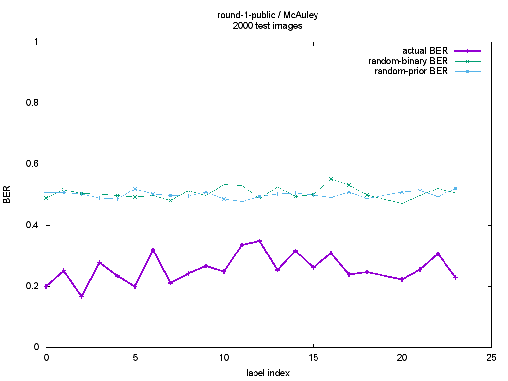
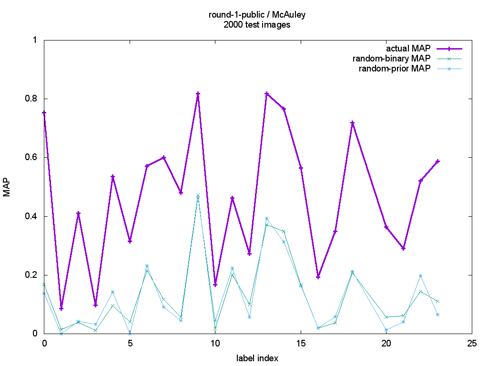
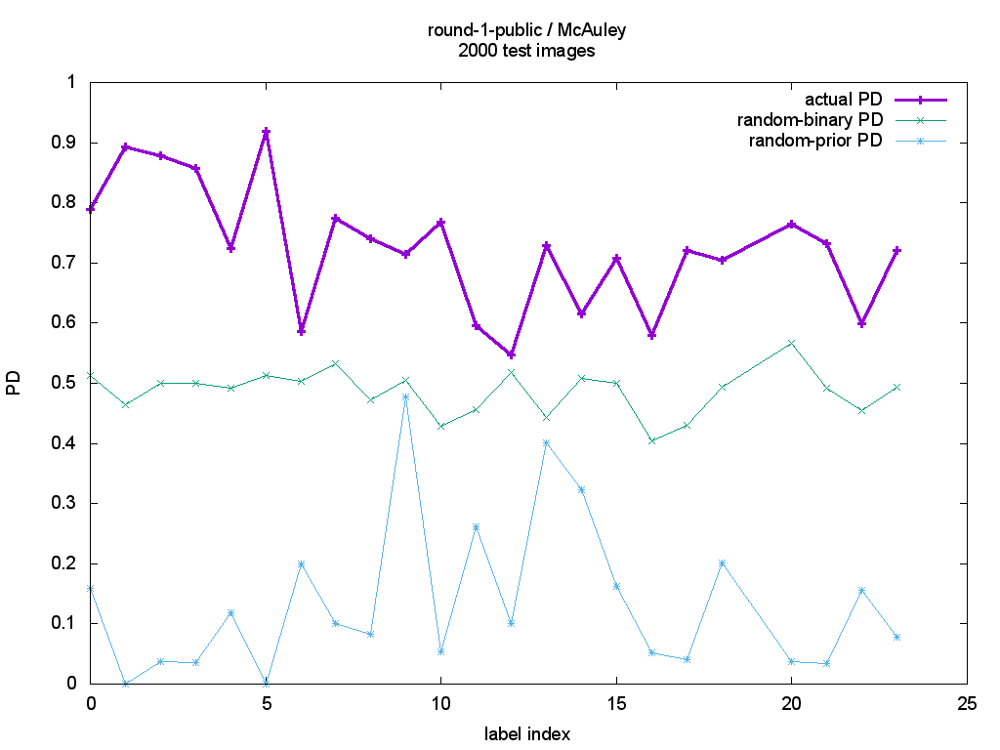

# Sample scores on round-1-public

Two sample non-probabilistic solutions to CP6 are available. The first is the implementation from McAuley's original paper; the second is a sample CRF implementation available in the `baseline\_crf\_scripts` directory of the CP6 git repository.

Scores from McAuley's implementation are presented here; scores from the sample CRF implementation are in preparation. Once available, this page will be updated to reflect them.

## McAuley's scores on round-1-public

These are the results of running round-1-public through the implementation from McAuley's original paper. [His web page is here](http://cseweb.ucsd.edu/~jmcauley/), the relevant section is under "2012: Image labeling on a network: using social-network metadata for image classification."

### Running PPAML on McAuley's code

The file `ppaml-tweaks.patch` contains some random fixes I made to McAuley's code, mostly to clean up the parser so it would pass valgrind without complaining. I compiled and ran the code on OS X.

Results are provided for BER (balanced error rate), MAP (mean average precision), and PD (probability of detection.)

The `sandbox_adapter.py` script converts a PPAML sandbox into the set of files expected by McAuley's code, along with configuration files for each of the labels.

The scripts `train-all-labels.sh` and `test-all-labels.sh` run McAuley's code to train and test across all the labels for round 1. The perl script `mcauley2ppaml.pl` converts the output from the `test-all-labels.sh` script into the format expected by the PPAML scoring code in `cp6_eval.py`.  The file `bmrm-thresh.txt` contains the thresholds used to convert floating point values to 0/1 decisions (the thresholds are all zero.)

### The results

The graphs below show the output for three evaluations:

1. The "actual {BER, MAP, PD}" line is the result from McAuley's code. These were plotted from the `mcauley-round-1-public.csv` file generated via `cp6_eval.py` above.

2. The "random-binary" results replace the computed result with a random 0 / 1 result selected with equal probability (i.e. a coin flip.) This is the `--r b` flag to `cp6_eval.py`.

3. The "random-prior" results replace the computed result with a random 0 / 1 results selected proportionally to the distribution of the label in the truth set. This is the `--r p` flag to `cpy_eval.py`.

---
*questions, comments, &c to roddy.collins (at) kitware.com*
